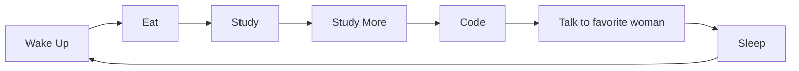

    
    <h1 All api;s used are opensource and provided my me to myself/>
<h3>
        
    </h3>

    

 

## GitHub Stats

    
    

    

---
---

## Activity Graph

---
## About Me

I'm @me_straight, just some dev who started coding as a hobby. I keep things simple and don't charge crazy prices, i did a lot of work for random collage dudes and i contributed to femboy-hotline.com XDDDD

**Currently Working On:** **Ayumi** - Discord bot focusing on music & anti-raid and nsfw and cybersecurity tools and mudae AAAAND moderation anddddd anime commands (bonk etc). Lmao
**Learning:** Rust and Electron
**Building With:** React • Next.js • TypeScript • Whatever seems fun  
## **Freelance:** Available - Discord bots, websites, APIs, backend of any kind services, redesign, continuation of projects, Startup's system admin, custom solutions and hosting panels.

    
    

---

## Tech Stack

### Frontend

### Backend & Tools

📦 <b>More Tools & Technologies</b>

 

**Languages**
- TypeScript • JavaScript • Rust • Python

**Frameworks & Libraries**
- React • Next.js • Vue.js • Discord.js • Node.js and i forgor, i hate vanilla html css code tho, so most sites i write are in next+ts

**Currently Learning**
- Rust - making things blazingly fast
- electron - desktop apps

---

## Recently listened to

    

---

## What I Do

| Service | Description |
|:---:|:---|
| **Discord Bots** | Custom bots with music, moderation, anti-raid, and more |
| **Websites** | Modern, responsive web applications using React/Next.js |
| **APIs** | RESTful APIs and backend services |
| **Custom Solutions** | Whatever you need built - just ask! |

## Current Routine

---

    
    
**@me_straight on Discord or email, laxenta.inc@gmail.com**

 Need something built? DM me. Prices are reasonable. Simple, i will give a demo before anything, I did a lot of freelance work for collage students in past and 2-3 failed startups (not my fault they failed) 

